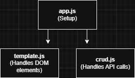

## PRC IT Web Developer Assignment

### Goal
Build a responsive events signup web app that fetches company-hosted events from an API, 
supports search and filtering, and allows users to create, edit, and delete event registrations.

## Tech
- Bootstrap
- Vanilla JS

## Setup
- Use 'Live Server' extension in VS Code
- or just view the site here on <a href="https://brobrigado.github.io/events-signup/" target="_blank">brobrigado Github Pages</a>

## Tech choices

To keep things simple, I made the site with 2 main classes, Template and Crud. Template handles anything to do with the DOM Element, and Crud handles calls to the crudcrud API. Bootstrap was used to keep a clean and consisted style throughout the site.

## Issues

If I had more time, I would add more classes to seperate the code even more. For example, I would create a new class for form validation separting it from Crud. I would also refactor the transition between the event list page and the single event page. Possibly making a new class just to handle page transitions.

## Conclusion

Thank you for reviewing my site. Feel free to contact me if you have any questions about the project.